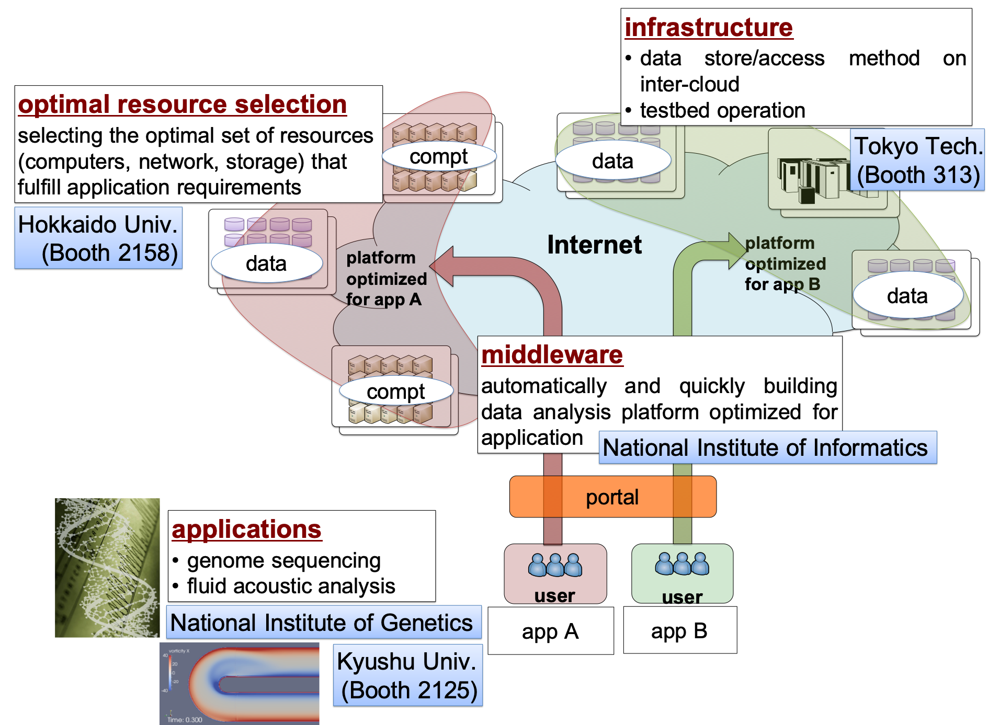
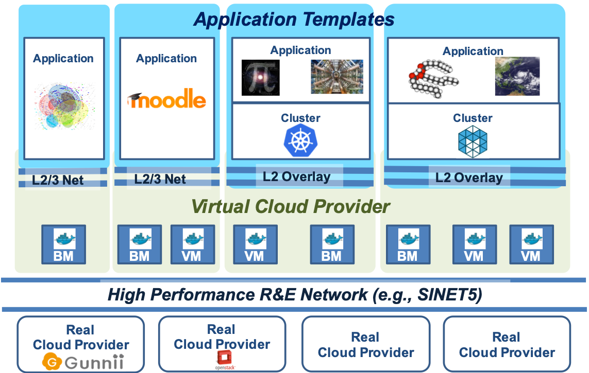
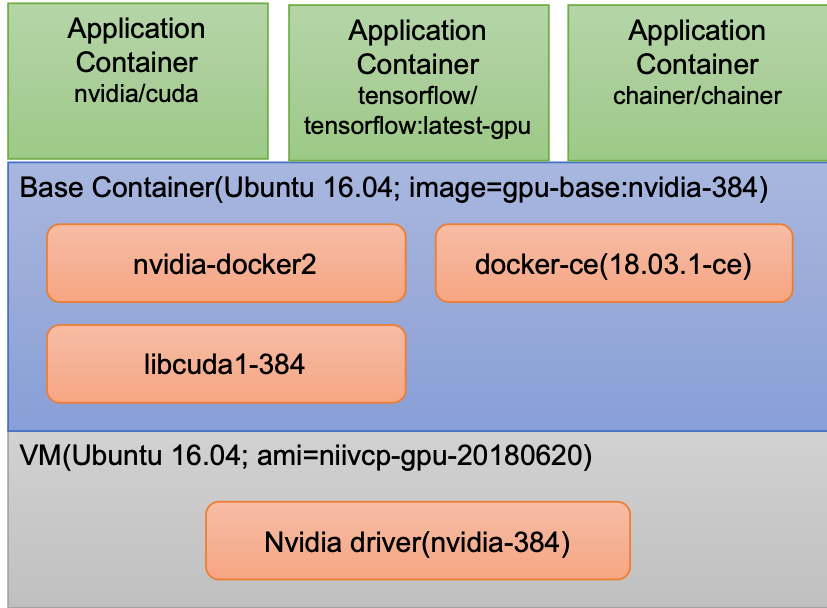
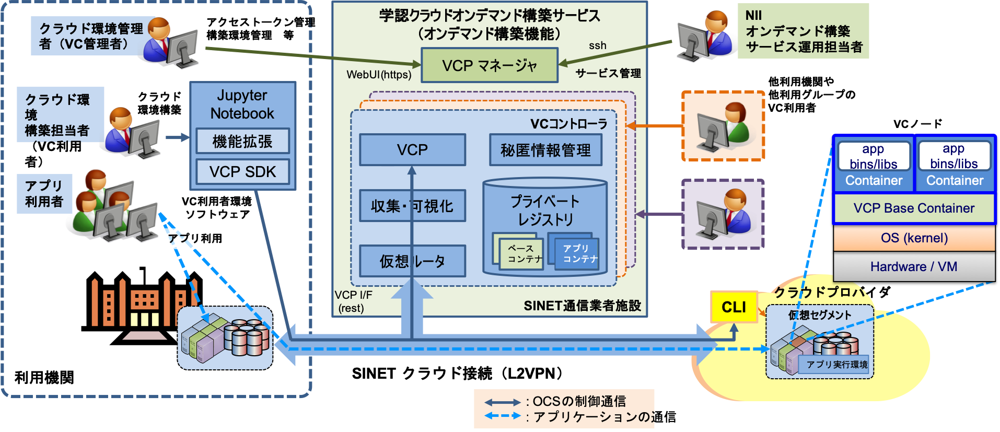
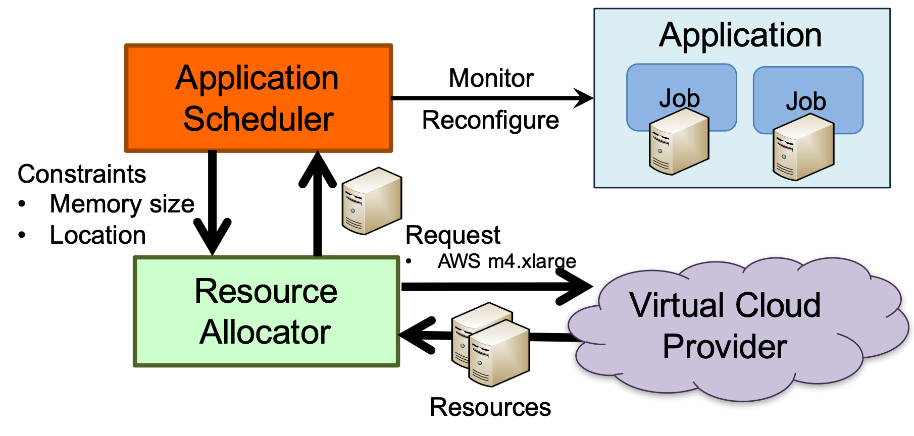
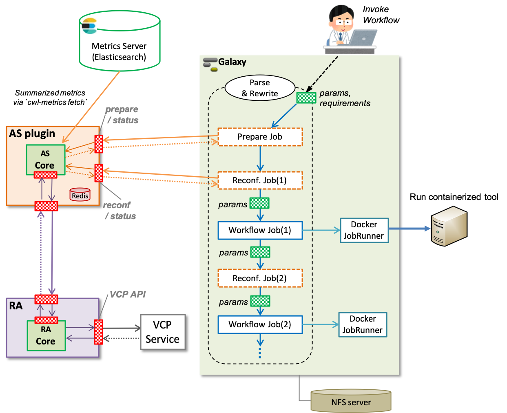
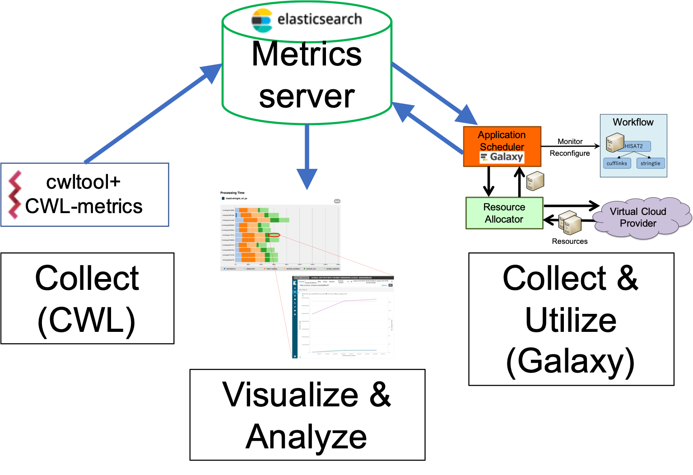

## TODO
- 図のサイズ調整
- OCS への言及+リンク追加？
- 全体構成を練る

# Application-Centric Overlay Cloud Utilizing Inter-Cloud

Optimized and dedicated data analysis platforms are needed to fulfill the diverse requirements of big data applications. However, building an optimized platform is not easy. We propose the application-centric overlay cloud, which is an infrastructure to automatically build data analysis platforms customized for applications over multiple clouds.

## Research Goal
- Develop new infrastructure technology to automatically build data analysis platforms that are optimized for applications. We call this infrastructure the *application-centric overlay cloud*.
- Build an inter-cloud testbed configured by production-ready computing and networking resources.
- Apply the overlay cloud technology to genome sequencing (distributed data processing) and fluid acoustic analysis (coupled simulation).

NII group developed the following middleware.

## Virtual Cloud Provider (VCP)
- VCP is a middleware to build an application environment over multiple clouds and the Japanese academic backbone network SINET5.
- VCP supports from a simple application environment on a single cloud to a complex application environment using multiple clouds.
- VCP leverages Docker containers for quick application deployment and application environment reproducibility.
- VCP supports both common and GPU-enabled virtual machines (VMs).
- VCP supports the following cloud providers;
 - Public Cloud providers: Amazon Web Services, Microsoft Azure, Oracle Cloud Infrastructure, Sakura Cloud
 - Academic Cloud Provider: Hokkaido-Univ. Server Service
 - On-premiss provider: VMware

VCP is used as a main service of NII's GakuNin Cloud On-demand Configration Services.
- A Python-based development kit called VCP SDK and a monitoring tool are provided.
- Jupyter Notebook-based templates for typical academic applications, such as moodle, Galaxy, and OpenHPC.

## Dynamic Reconfiguration Framework
We propose a framework that adds and removes computing resources (BM or VM) during runtime. The main idea is that we can represent requirements of computing resources to be reconfigured as constraints on specifications of computing resources.

It consists of two subsystems:
- The *application scheduler* monitors the application state and sends the constraints for new computing resources (e.g., #CPU cores, memory size, and location of resources to handle privacy-sensitive data) to the resource allocator.
- The *resource allocator* finds the resources that satisfy the constraints from the application scheduler and allocate them by using VCP.

### A prototype for genome analysis workflows
We developed a prototype based on Galaxy for genome analysis workflows. It consists of several modules: Galaxy, an application scheduler module (AS module in the figure), a resource allocator (RA in the figure), metrics server and VCP. Galaxy and an AS module behave as an application scheduler.

Our prototype introduces two types of virtual workflow step: `prepare job` and `reconf job` for dynamic reconfiguration:
- The `prepare job` step is invoked before executing a workflow and makes an allocation plan
- The `reconf job` step is invoked before executing each step and allocates computing resources according to the allocation plan.

These virtual steps interact with an AS module to make a plan and allocate computing resources. An *AS core* is a reconfiguration algorithm in the AS module and is designed as an external program to easily replace with other reconfiguration algorithm. We integrated our prototype with the reconfiguration algorithm by Hokkaido University group.

#### Metrics Collection Scheme in our Reconfiguration Framework

Our prototype collects two types of metrics: *container metrics* and *workflow metrics*.

- Container metrics: Telegraf on the resource periodically collects container metrics such as CPU usage and memory usage.
- Workflow metrics: After finishing workflow execution, an application scheduler generates workflow metrics such as execution time for each step.

<!--  -->

We design the metrics format of workflow metrics to be compatible with workflow metrics obtained by [CWL-metrics](https://inutano.github.io/cwl-metrics/) by National Institute of Genetics group, which is a metrics collector for Common Workflow Language (CWL).

## An Ecosystem to Utilize Execution Records ofGenome Analyses Workflows
Collecting workflow metrics such as execution time for each step is important for selecting appropriate computing resources. We have developed .

- We developed a prototype of our reconfiguration system based on Galaxy as described above. It collects and utilizes workflow metrics and container metrics.
- We also developed DrillHawk, which is a visualizer of workflow metrics.
- Our reconfiguration system and DrillHawk utilize container metrics and workflow metrics obtained by CWL-metrics as well as the metrics obtained by our prototype.

### DrillHawk: A Visualizer of Workflow Metrics

[DrillHawk](https://github.com/tom-tan/drill-hawk) enables us to take a drill-down approach in which we first check the list of collected workflow execution records, compare several execution records using workflow metrics, and analyze the specific execution records by using Kibana.

- Listing collected workflow records

- Comparing several workflow records
  - Execution time for each step
  - Monetary cost for each step

- Investigate with Kibana

## Acknowledgement
This work was supported by JST CREST Grant Number JPMJCR1501, Japan.
